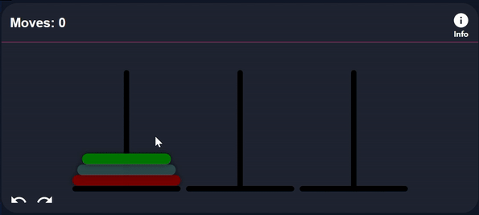

<h2 align="center">BITS UNPLUGGED</h3>

<p align="center">
    
</p>

Live and running on: https://bitsunplugged.onrender.com

Demonstration video: https://youtube.com/playlist?list=PLJrKTL3IoxQkCJpkynAzqOp3Fb4WUohho&si=BwDb9FD3IyjM06UB
## About The Project

- An innovative platform where users can enhance problem-solving skills without coding.
- A seamless and user-friendly interface for engaging with data structure and algorithmic challenges.
- Facilitate conceptual understanding by focusing on problem-solving approaches rather than coding syntax.


## Why Use Our Platform?

Our motivation was to provide a unique learning experience that focuses on conceptual understanding rather than coding syntax. Currently all the problem solving and competitive platforms for CS are based on coding, which creates an overhead. So, we tried to make the problem solving process interactive, where users can solve problems in our canvases by simply drag and dropping. This platform is also useful for those who don't know coding but want to increase their problem solving skills. But this doesn't mean that this platform is not for CS students. This will be very useful in theory courses like Data Structure and Algorithms, where students can visualize the problems and solutions.
There are visualizer websites where we can visualize these types of problems. But a proper problem solving platform like this is not available. So, we tried to fill that gap by providing learning materials, interactive problems, realtime contests, recommendations and analytics in one platform.

## Features

### Problem Solving

- Solve problems interactively, removing the overhead of coding.
<p align="center">
    
</p>

### Problem Setting

- As a problem setter, you can create problems with our fully customizable canvas editors

<p align="center">
<video width="280" src="https://github.com/mahirlabibdihan/bitsunplugged/assets/62663759/42ae52c2-6765-4fbb-a38a-8965217e8449" autoplay loop muted>
</video>
</p>

### Read Articles

- Topic wise Learning materials
- Example problem and solution in each article
- Recommend problems based on reading history

### Contest

- Participate in Realtime contests
- Practice previous contests within a Virtual environment
- Contest ratings

### Analytics

- Problem Rating based on User submissions
- Contest Rating based on Contest ranking
- Time taken to solve a problem compared to other users
- List of recently accessed problems, Unsolved problems

### Recommendation

- Get recommendations based on Contest rating, Article reading history and Practice problem performance

### Dashboard

- Showcase problem solving skill

## Snapshots


## Project Setup

Follow the step by step installation procedure to install and run this on your machine.

## Prerequisites

Make sure you have node and postgresql installed in your device.

**`NodeJs`**: Install Nodejs from [here](https://nodejs.org/en/download/)
**`PostgreSQL`** Install PostgreSQL from [here](https://www.postgresql.org/download/)

## Installation <a name="configuration"></a>

1.  Clone the repo

```sh
git clone https://github.com/mahirlabibdihan/dEducation-frontend.git
```

2.  If you don't have git installed in your device then download zip
3.  After installation or download go to the repository and open command line.

### Configuring Backend

1. Go to backend directory

```sh
cd backend
```

2. Install NPM packages

```sh
npm install
```

#### Configuring Database

```sh
npx sequelize db:create
npx sequelize db:migrate
npx sequelize db:seed:all
```

#### Setting up the environment variables

create a new file `.env` in the root directory. And the file should have the followings

```sh
DB_USER=YOUR_DB_USER
DB_PASS=YOUR_DB_PASS
DB_PORT=POSTGRES_PORT
DB_DB=YOUR_INITIAL_DATABASE
PORT=YOUR_FAVOURITE_PORT
JWT_SECRET=YOUR_DARKEST_SECRET
EMAIL_USER=YOUR_EMAIL_ADDRESS
EMAIL_PASS=YOUR_EMAIL_APP_PASSWORD
```

If you followed the above then the `.env` should look like this

```sh
DB_USER=postgres
DB_PASSWORD=password
DB_PORT=5432
DB_DB=bitsunplugged
PORT=5000
JWT_SECRET=kuddusmia
EMAIL_USER="1905072@ugrad.cse.buet.ac.bd"
EMAIL_PASS="password_bolbo_na"
```

We are finally good to go

#### Run the project

Go to your favourite code editor and run

```sh
npm start
```

You should find that the project is working!

### Configuring Frontend

1. Go to frontend directory

```sh
cd frontend
```

2. Install NPM packages

```sh
npm install
```

3.  Ensure backend is configured and running correctly on "http://localhost:5000" (note the port number)

#### Run the project

Go to your favourite code editor and run

```sh
npm start
```

You should find that the project is working!

## Languages, Tools and Frameworks:<a name="tools"></a>

- <h4>Frontend</h4>

  - React.js
  - Tailwind
  - Material Ui
  - React-Konva

- <h4>Backend</h4>

  - Node.js
  - Express.js
  - PostgreSQL
  - Sequelize ORM
  - Passport.js

## Supervisor

- Hasebul Hasan

  - **Adjunt Lecturer**

    :arrow_forward: **Contact:**

    Department of Computer Science and Engineering
    Bangladesh University of Engineering and Technology
    Dhaka-1000, Bangladesh

<p align="right">(<a href="#top">back to top</a>)</p>
